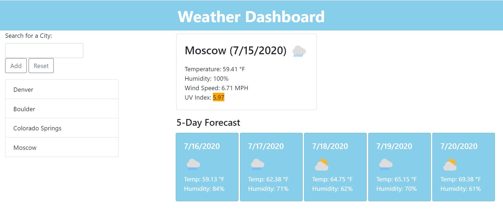
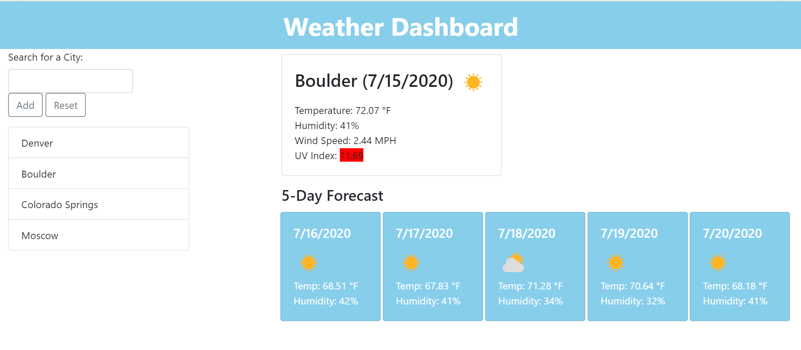

# Weather Dashboard

**You can access the finished project here:
<https://mi544.github.io/weather-dashboard/>**

---

# Unit 06 Server-Side APIs: Weather Dashboard

### The task

Build a weather dashboard that will make use of third-part APIs.

* App runs in the browser
* Features dynamically updated HTML and CSS powered by JavaScript code
* Makes requests to the [OpenWeather API](https://openweathermap.org/api) with specific parameters
* Retrieves weather data for cities
* Uses `localStorage` to store any persistent data

## Requirements

* After searching for a city, future weather conditions for that city are presented
* That city is added to the search history
* Information about a city includes:
    * City name
    * Current date
    * Icon representation of weather conditions
    * UV index (has to color-indicate whether the conditions are favorable, moderate, or severe by utilizing colors)
* Information about a city also includes a 5-day weather forecast that has:
    * Future date
    * Icon representation of weather conditions
    * Temperature
    * Humidity 
* After clicking on a city from the search history, current and future weather conditions are presented for that city
* After opening the app again, last searched city weather information is automatically presented

